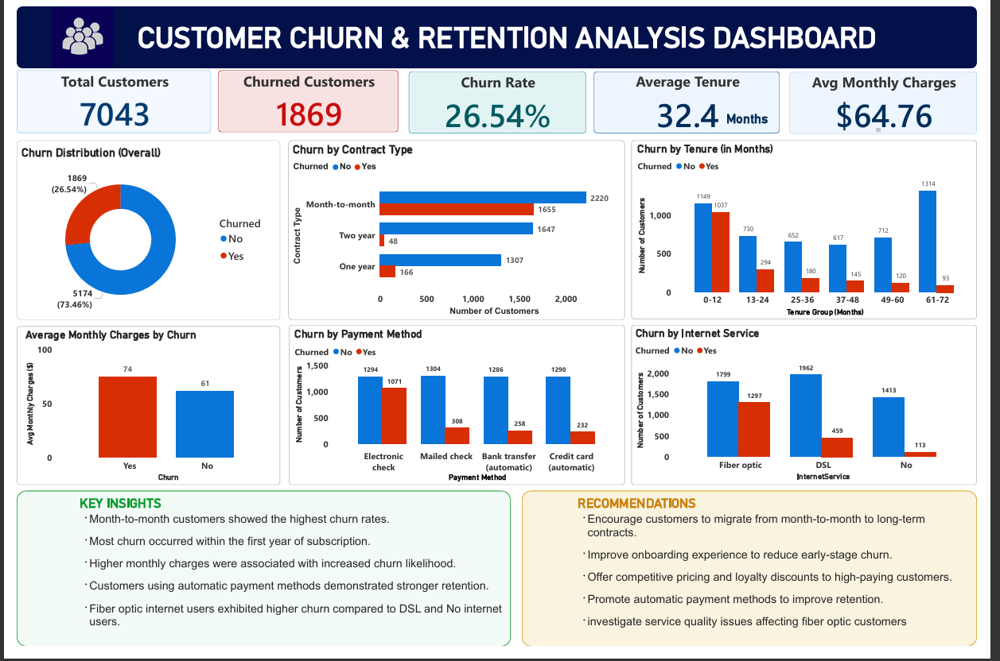

# Telecom Customer Churn Analysis
## Overview
This project aimed to explore customer churn behavior for a Telecom company to identify why customers leave and how the business can improve retention using data-driven insights.

## Objective
- Identify key drivers of customer churn.
- Analyze customer lifetime patterns.
- Identify at-risk customer segments.

## Tools Used
- Microsoft Power BI (Data cleaning, modeling, visualization, and dashboard building).

## Dataset Overview
- Source : Kaggle
- Size: 7044 rows, 21 columns
- Target: Customer Churn
  ### Key features
  - Customer demographics
  - Subscription details
  - Tenure
  - Monthly charges
  - Contract type

## Dashboard Preview

## Key insights
- Month-to-month customers showed the highest churn rates.
- Most churn occured within the first year of subscription.
- Higher monthly charges coreelated with elevated churn risk.
- Automatic payment users demonstrated stronger retention.
  
## Recommendations
- Encourage customers to migrate to long-term contracts.
- Improve early customer onboarding experience.
- Offer loyalty incentives to high-value customers.
- Promote automatic payment enrollment.
